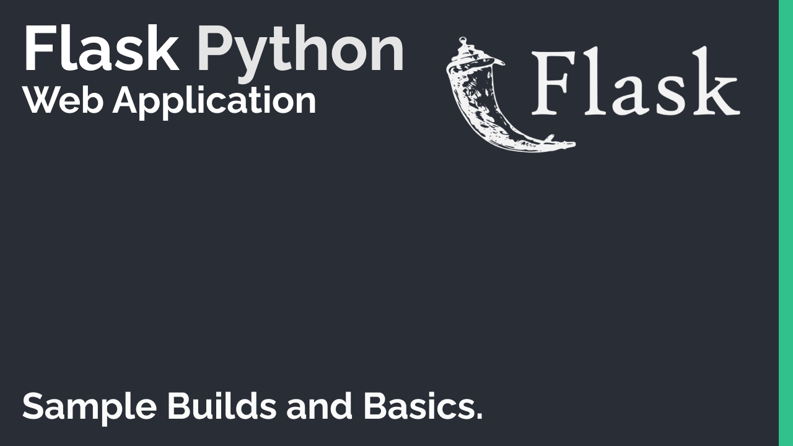

# Python Web HTTP (Basics).

Following Project Includes.
- Clone Application which includes following.
- Basic Configuration of Flask to setup a Web Application.
- Routing with Flask.
- Backend with Flask and SQL Database.
- Create Object Schemas to save data.
- Foreign key relation with two schemas.
- Login authentication of users with flask-login.
- Flask Fundementals.
